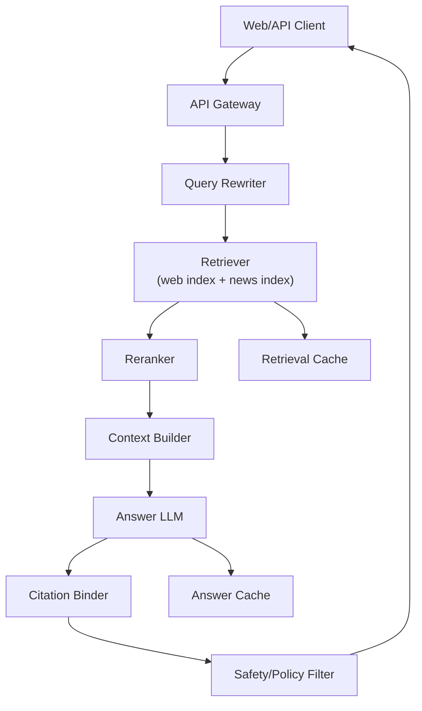

# System Design Walkthrough — Perplexity-Style AI Search Engine

> Language-agnostic walkthrough using the 6-step framework from `00-system-design-framework.md`.

---

## The Question

> "Design an AI answer engine like Perplexity. Users ask natural-language questions and get concise answers with citations from web sources."

---

## Core Insight

A Perplexity-style system is not just "LLM + web search". It is a **latency-constrained retrieval pipeline** where quality depends on:

1. Retrieving fresh, relevant sources quickly.
2. Grounding generation on retrieved evidence.
3. Showing citations users can trust.

If retrieval is weak, the LLM sounds fluent but wrong.

---

## Step 1 — Clarify Requirements

### Functional Requirements

| # | Requirement |
|---|-------------|
| F1 | User asks free-text question |
| F2 | System returns short synthesized answer |
| F3 | Answer includes source citations (links/snippets) |
| F4 | Follow-up questions supported (multi-turn context) |
| F5 | Real-time web freshness for newsy topics |
| F6 | API and web UI support |

Out of scope: image generation, enterprise private docs, ads ranking.

### Non-Functional Requirements

| Attribute | Target |
|-----------|--------|
| DAU | 20M |
| Query latency | < 2.5s p95 end-to-end |
| Availability | 99.9% |
| Citation precision | >= 90% answer claims linked to evidence |
| Freshness | New public pages visible within minutes |

---

## Step 2 — Back-of-the-Envelope

```
Traffic:
  20M DAU x 8 queries/day = 160M/day
  160M / 86,400 ~= 1,850 qps average
  Peak (4x) ~= 7,400 qps

Retrieval fanout:
  Per query, fetch top 30 documents
  7,400 qps x 30 = 222,000 doc fetch/scoring ops/s

LLM generation:
  Avg input 6k tokens, output 500 tokens
  Peak tokens/s dominates cost and GPU sizing

Cache opportunity:
  Repeated popular queries ~20%
  Caching final answers can cut LLM load materially
```

### Why These Numbers Drive Design

- 7,400 qps is manageable for query routing, but 222,000 retrieval operations/s means **retrieval infra is the hot path**.
- High LLM token volume means you must use **multi-layer caching** (query cache, retrieval cache, prompt prefix cache).
- End-to-end <2.5s p95 forces **parallel execution** (query rewrite, retrieval, rerank overlap where possible).

---

## Step 3 — High-Level Design



---

## Step 4 — Deep Dives

### 4.1 Retrieval Pipeline

- Query rewrite expands ambiguous intent (entities, date constraints, synonyms).
- Hybrid retrieval:
  - BM25 keyword index for lexical precision.
  - Vector index for semantic recall.
- Merge top-k results, then cross-encoder reranker selects final 8–12 chunks.

Design choice: hybrid retrieval over vector-only.
Reason: vector-only can miss exact facts/names; BM25 catches exact mentions.

### 4.2 Citation Binding

- Context builder tags each chunk with stable source IDs.
- LLM instructed to emit claim-to-source references.
- Post-processor validates reference IDs exist in supplied context.
- Unverifiable claims are either removed or marked as uncertain.

Design choice: explicit citation IDs rather than fuzzy URL matching after generation.
Reason: deterministic and auditable.

### 4.3 Freshness Architecture

- Continuous crawler feeds near-real-time news index.
- Separate freshness tier for recent docs (<48h) with higher scoring prior.
- For evergreen queries, rely more on stable web index.

Trade-off: fresher results can be noisier; reranker + source-quality signals counteract this.

### 4.4 Latency Budget

Example p95 budget:

```
Gateway/auth           80ms
Query rewrite         120ms
Retrieve + rerank     700ms
LLM generate         1200ms
Citation + safety     250ms
Total               ~2350ms
```

This budget forces strict timeout policies and fallback:
- If reranker exceeds deadline, use retriever top-k directly.
- If LLM slow path triggers, return shorter answer first, then expand.

---

## Step 5 — Failure Modes

| Failure | Mitigation |
|---------|------------|
| Search backend timeout | Fallback to cached retrieval set |
| LLM overloaded | degrade to smaller model + shorter response |
| Citation mismatch | suppress claim or mark uncertain |
| Crawler lag | display freshness indicator and timestamp |

---

## Step 6 — Trade-offs

- Precision vs latency: deeper reranking improves quality but adds 100–300ms.
- Freshness vs trust: very new sources may be low quality.
- Answer length vs speed: long outputs increase cost and p95.

Real-world apps to relate: Perplexity, Bing Copilot answer mode, Google AI Overviews.
