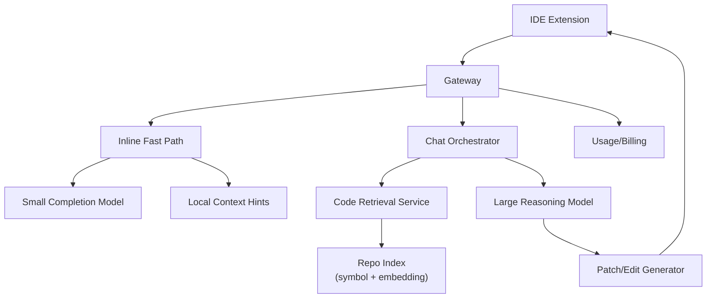

# System Design Walkthrough — GitHub Copilot-Style Coding Assistant

> Language-agnostic walkthrough using the 6-step framework from `00-system-design-framework.md`.

---

## The Question

> "Design an AI coding assistant like GitHub Copilot for IDE inline completions and chat assistance over repository context."

---

## Core Insight

A coding assistant is two products with different SLOs:

1. **Inline completion**: ultra-low latency (<200ms perceived).
2. **Chat/code reasoning**: higher latency acceptable (1–5s), deeper context.

If you treat both as one pipeline, inline UX becomes unusable.

---

## Step 1 — Clarify Requirements

### Functional Requirements

| # | Requirement |
|---|-------------|
| F1 | Inline multi-token code completion while typing |
| F2 | Conversational coding chat in IDE |
| F3 | Repo-aware responses (current file, nearby symbols, project context) |
| F4 | Suggested edits and patch generation |
| F5 | Per-user usage limits and telemetry |

Out of scope: CI bot comments, autonomous code execution.

### Non-Functional Requirements

| Attribute | Target |
|-----------|--------|
| Active users | 10M developers |
| Inline latency | < 200ms p95 first token |
| Chat latency | < 4s p95 |
| Availability | 99.9% |
| Privacy | strict tenant/user code isolation |

---

## Step 2 — Back-of-the-Envelope

```
Inline events:
  10M users, 2M concurrent peak
  Assume 0.2 completion requests/sec per active user
  => 400,000 inline requests/s peak

Chat requests:
  2M active, 0.003 req/sec
  => ~6,000 chat requests/s peak

Context retrieval:
  If each chat request pulls 50 code chunks,
  6,000 x 50 = 300,000 chunk retrievals/s
```

### Why These Numbers Drive Design

- 400k inline req/s means **small model + aggressive edge routing + local heuristics**.
- Chat qps is much lower but context-heavy, so **retrieval/indexing quality** matters more than raw request count.
- This naturally leads to split architecture: fast path (inline) and deep path (chat).

---

## Step 3 — High-Level Design



---

## Step 4 — Deep Dives

### 4.1 Inline Completion Fast Path

- Input kept minimal: cursor window, recent lines, language ID.
- Use small specialized model for latency.
- Client-side debounce and speculative requests reduce perceived delay.

Design choice: do not include full-repo retrieval on inline path.
Reason: retrieval latency would violate <200ms target.

### 4.2 Repo-Aware Chat Retrieval

- Parse/index repo continuously:
  - Symbols, definitions, references.
  - Chunked embeddings for semantic lookup.
- Retrieval blend:
  - Lexical search for exact identifiers.
  - Vector search for conceptual matches.
- Context packing chooses top chunks within token budget.

Design choice: pre-built repo index per branch/workspace.
Reason: on-demand indexing per chat is too slow.

### 4.3 Edit Safety and Patch Application

- Model returns structured edits (file path + hunks), not free-form text only.
- Apply patch preview in IDE with user confirmation.
- Post-check pipeline: syntax parse, optional lint/test quick pass.

Trade-off: safety checks add latency but reduce broken edits.

### 4.4 Privacy Boundaries

- Tenant-aware isolation at retrieval and logging layers.
- Sensitive content redaction in telemetry.
- Retention controls configurable for enterprise.

---

## Step 5 — Failure Modes

| Failure | Mitigation |
|---------|------------|
| Inline model overload | degrade to shorter suggestion or local fallback |
| Repo index stale | background reindex + freshness flag |
| Patch fails to apply | auto-rebase hunk or return conflict guidance |
| Retrieval timeout | continue with local-file context only |

---

## Step 6 — Trade-offs

- Latency vs quality for inline predictions.
- More context vs token cost in chat.
- Safety checks vs responsiveness when generating patches.

Real-world apps to relate: GitHub Copilot, Cursor, Codeium, Amazon Q Developer.

---

## API Design Snapshot

### Core endpoints
- `POST /v1/completions` code completion generation.
- `POST /v1/chat` conversational coding assistant endpoint.
- `POST /v1/context/build` repository context construction.
- `GET /v1/models/capabilities` model routing/capability lookup.
- `POST /v1/telemetry/events` acceptance/usage events.

### Reliability and consistency
- Completion requests include deterministic request IDs for safe retries.
- Context build and embedding tasks are async and cache-backed.
- Graceful fallback when premium model pools are saturated.

### Security and limits
- Repository permission checks before context retrieval.
- Strong data-boundary guarantees for enterprise tenants.

---

## API Data Model and Contract (Ordered)

### 1) Domain resources and ownership
- `CompletionRequest`: editor-context generation input.
- `CompletionResult`: ranked candidate outputs and model metadata.
- `ContextBundle`: repository symbols/chunks used for grounding.
- `ChatSession`: multi-turn coding assistant context.
- `AcceptanceEvent`: telemetry for ranking feedback loops.

### 2) Storage and indexing model
- Context bundles cached by `(repo_id, branch, revision_hash)`.
- Indexes:
  - `idx_completion_by_repo(repo_id, created_at desc)`
  - `idx_bundle_by_repo(repo_id, updated_at desc)`
  - `idx_acceptance_by_request(request_id)`
- Async indexing and embedding updates for repo changes.

### 3) Endpoint matrix (comprehensive)
- `POST /v1/completions` inline completion generation.
- `POST /v1/chat` conversational coding requests.
- `POST /v1/context/build` construct context bundle.
- `GET /v1/context/{bundle_id}` context status/detail.
- `GET /v1/models/capabilities` model routing metadata.
- `POST /v1/telemetry/events` acceptance/latency events.
- `POST /v1/policies/evaluate` enterprise policy check.
- `GET /v1/usage?cursor=...` org-level usage reporting.

### 4) Contract examples
Write contract: `POST /v1/completions`
```json
{
  "client_request_id": "cmp_611",
  "repo_id": "r_17",
  "file_path": "src/app.ts",
  "cursor": {"line": 120, "col": 18},
  "prefix": "function build",
  "suffix": "return out"
}
```
```json
{
  "request_id": "req_900",
  "candidates": [{"text": "...", "score": 0.82}],
  "model": "code-large",
  "state": "completed"
}
```
Read contract: `GET /v1/context/{bundle_id}`
```json
{
  "bundle_id": "cb_91",
  "state": "ready",
  "symbol_count": 12440,
  "revision_hash": "a1b2c3"
}
```

### 5) Idempotency, concurrency, and consistency
- Completion dedupe by `(repo_id, client_request_id)`.
- Context build idempotent per repo revision hash.
- Privacy-first fail-closed behavior on context authorization failures.

### 6) Error taxonomy
- `403_REPO_ACCESS_DENIED`
- `409_CONTEXT_BUILD_IN_PROGRESS`
- `429_MODEL_POOL_THROTTLED`

### 7) Security, quotas, and observability
- Strict repo ACL and enterprise data-boundary enforcement.
- Quotas by seat/org/model tier.
- Metrics: `time_to_first_suggestion_ms`, `suggestion_accept_rate`, `context_build_latency_ms`.

### 8) Webhook and event contracts (where applicable)
- Enterprise and analytics callbacks:
  - `completion.generated`
  - `completion.accepted`
  - `context.build.completed`
- Delivery contract:
  - Headers: `X-Event-Id`, `X-Event-Type`, `X-Signature`, `X-Org-Id`
  - Body fields: `request_id`, `repo_id`, `user_id_hash`, `model`, `latency_ms`, `event_ts`
- Reliability rules:
  - At-least-once delivery with replay support.
  - Dedupe key for sinks: `event_id`.
  - Privacy-safe payloads (no raw code content in analytics webhooks).

Example `completion.accepted` payload:
```json
{
  "event_id": "evt_cp_61",
  "event_type": "completion.accepted",
  "request_id": "req_900",
  "repo_id": "r_17",
  "model": "code-large",
  "latency_ms": 142,
  "event_ts": "2026-05-13T20:22:00Z"
}
```
