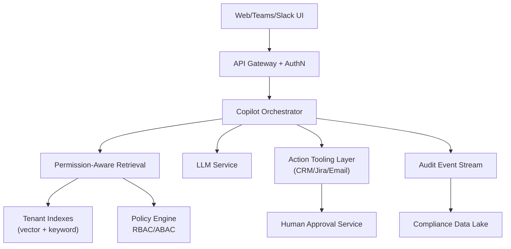

# System Design Walkthrough — Enterprise Copilot (Notion AI / Microsoft 365 Copilot Style)

> Language-agnostic walkthrough using the 6-step framework from `00-system-design-framework.md`.

---

## The Question

> "Design an enterprise AI copilot that answers questions and performs actions across company data (docs, email, tickets, CRM) with strict permissions and auditability."

---

## Core Insight

Enterprise copilots are primarily a **trust and governance system** with AI on top:

1. Retrieval must be permission-aware (never leak unauthorized data).
2. Actions need approval controls and audit logs.
3. Reliability and compliance often matter more than model cleverness.

---

## Step 1 — Clarify Requirements

### Functional Requirements

| # | Requirement |
|---|-------------|
| F1 | Ask natural-language questions over enterprise data |
| F2 | Retrieve and summarize docs/emails/tickets with citations |
| F3 | Execute actions (create ticket, send draft email, update CRM) |
| F4 | Role-based and document-level access control |
| F5 | Human approval for risky actions |
| F6 | Full audit trail for every answer/action |

Out of scope: public web search as primary source, model fine-tuning pipeline.

### Non-Functional Requirements

| Attribute | Target |
|-----------|--------|
| Tenants | 100k organizations |
| P95 answer latency | < 5s |
| Availability | 99.95% |
| Data leakage tolerance | zero cross-tenant leakage |
| Audit retention | 1-7 years (policy dependent) |

---

## Step 2 — Back-of-the-Envelope

```
Assume 100k tenants, 2k active users each peak global mix not simultaneous.
Global peak query load ~50,000 qps.

Per-query retrieval:
  20 candidate chunks from tenant-scoped indexes
  => 1,000,000 chunk lookups/s at peak

Audit logs:
  50k qps x 2 KB event payload ~100 MB/s
  ~8.6 TB/day of raw logs before compression
```

### Why These Numbers Drive Design

- 50k qps is feasible, but only with **strong tenant partitioning** and precomputed indexes.
- 8.6 TB/day log volume forces **streaming log pipeline + tiered storage**, not ad-hoc DB inserts.
- Permission checks per chunk imply access control must be in retrieval index metadata, not bolted on later.

---

## Step 3 — High-Level Design



---

## Step 4 — Deep Dives

### 4.1 Permission-Aware Retrieval

- Every indexed chunk carries tenant ID + ACL metadata.
- Query filter enforces tenant and principal permissions before reranking.
- Final context contains only authorized chunks.

Design choice: filter-before-generate.
Reason: post-generation filtering cannot prevent model exposure to sensitive content.

### 4.2 Action Execution with Guardrails

- Tool calls are schema-validated.
- Risk-scored actions:
  - Low risk: auto-execute (e.g., draft internal note).
  - Medium/high risk: require human approval.
- Idempotency keys prevent duplicate side effects.

Example: "Send refund email to customer" requires manager approval + logged reason.

### 4.3 Audit and Compliance

- Emit immutable events for:
  - user prompt,
  - retrieved sources IDs,
  - model response,
  - action request/approval/execution.
- Store in append-only stream then archive to WORM-capable storage.
- Build compliance views (who accessed what, when, why).

### 4.4 Multi-Tenant Isolation

- Logical + cryptographic isolation per tenant.
- Separate encryption keys per tenant via KMS.
- Rate limits and quotas per tenant prevent noisy-neighbor effects.

---

## Step 5 — Failure Modes

| Failure | Mitigation |
|---------|------------|
| Policy engine outage | fail-closed: deny retrieval/actions |
| Tool connector timeout | async retry queue + user-visible status |
| LLM timeout | return retrieval-only summary fallback |
| Audit sink lag | buffer in durable queue; block risky actions if audit unavailable |

---

## Step 6 — Trade-offs

- Strong governance vs latency (policy checks add overhead).
- More automation vs human approval friction.
- Rich logging vs storage/compliance cost.

Real-world apps to relate: Microsoft 365 Copilot, Notion AI, Slack AI, Salesforce Einstein Copilot.

---

## API Design Snapshot

### Core endpoints
- `POST /v1/orgs/{org_id}/assist` enterprise assistant request.
- `POST /v1/connectors/{connector_id}/sync` data connector sync trigger.
- `GET /v1/knowledge/search` enterprise retrieval endpoint.
- `POST /v1/policies/evaluate` policy and compliance decision point.
- `GET /v1/audit/events?cursor=...` audit trail export.

### Reliability and consistency
- Connector syncs are idempotent and checkpointed.
- Assist requests include policy-evaluation trace IDs.
- Knowledge index updates are async with freshness indicators.

### Security and limits
- Fine-grained RBAC/ABAC and document-level ACL filtering.
- Full auditability, retention controls, and per-org quotas.

---

## API Data Model and Contract (Ordered)

### 1) Domain resources and ownership
- `AssistRequest`: tenant-scoped prompt and policy context.
- `KnowledgeDoc`: indexed enterprise content with ACL tags.
- `PolicyDecision`: allow/deny + rationale artifact.
- `ConnectorSyncJob`: ingestion/sync checkpoint state.
- `AuditEvent`: immutable log for compliance investigations.

### 2) Storage and indexing model
- Multi-tenant index separated by org boundary and ACL labels.
- Indexes:
  - `idx_assist_by_org(org_id, created_at desc)`
  - `idx_doc_by_org_acl(org_id, acl_label, freshness_ts)`
  - `idx_audit_by_org(org_id, event_ts desc)`
- Sync checkpoints ensure incremental ingestion and replay safety.

### 3) Endpoint matrix (comprehensive)
- `POST /v1/orgs/{org_id}/assist` enterprise assistant request.
- `GET /v1/assist/{request_id}` retrieve status/output.
- `POST /v1/connectors/{connector_id}/sync` trigger sync.
- `GET /v1/connectors/{connector_id}/jobs/{job_id}` sync progress.
- `GET /v1/knowledge/search` ACL-aware retrieval.
- `POST /v1/policies/evaluate` policy decision point.
- `GET /v1/audit/events?cursor=...` audit export.
- `POST /v1/redaction/jobs` retroactive compliance redaction.

### 4) Contract examples
Write contract: `POST /v1/orgs/{org_id}/assist`
```json
{
  "client_request_id": "er_30",
  "user_id": "u_11",
  "prompt": "summarize Q2 incident report",
  "policy_mode": "strict"
}
```
```json
{
  "request_id": "req_1002",
  "state": "completed",
  "answer": "...",
  "policy_decision_id": "pd_88"
}
```
Read contract: `GET /v1/audit/events?cursor=ae_90&limit=2`
```json
{
  "items": [{"event_id": "ae_91", "action": "assist_request", "actor_id": "u_11"}],
  "next_cursor": "ae_91",
  "has_more": true
}
```

### 5) Idempotency, concurrency, and consistency
- Assist dedupe by `(org_id, client_request_id)`.
- Connector sync jobs dedupe by `(connector_id, source_checkpoint)`.
- Policy decision snapshot is attached immutably to each response.

### 6) Error taxonomy
- `403_POLICY_DENIED`
- `409_CONNECTOR_SYNC_RUNNING`
- `422_KNOWLEDGE_SCOPE_INVALID`

### 7) Security, quotas, and observability
- Mandatory RBAC/ABAC + document-level ACL filtering.
- Quotas by org, connector, and policy tier.
- Metrics: `policy_eval_latency_ms`, `acl_filter_hit_ratio`, `sync_freshness_lag_min`, `audit_export_p95_ms`.

### 8) Webhook and event contracts (where applicable)
- Enterprise integration callbacks:
  - `connector.sync.completed`
  - `connector.sync.failed`
  - `assist.policy_blocked`
- Delivery contract:
  - Headers: `X-Event-Id`, `X-Org-Id`, `X-Signature`
  - Body fields: `org_id`, `connector_id`, `job_id`, `state`, `reason`, `event_ts`
- Reliability rules:
  - At-least-once delivery with dead-letter routing for exhausted retries.
  - Dedupe by `event_id`; enforce tenant match with `org_id`.

Example `connector.sync.completed` payload:
```json
{
  "event_id": "evt_sync_88",
  "event_type": "connector.sync.completed",
  "org_id": "org_11",
  "connector_id": "con_7",
  "job_id": "job_91",
  "state": "completed",
  "event_ts": "2026-05-13T20:05:00Z"
}
```
