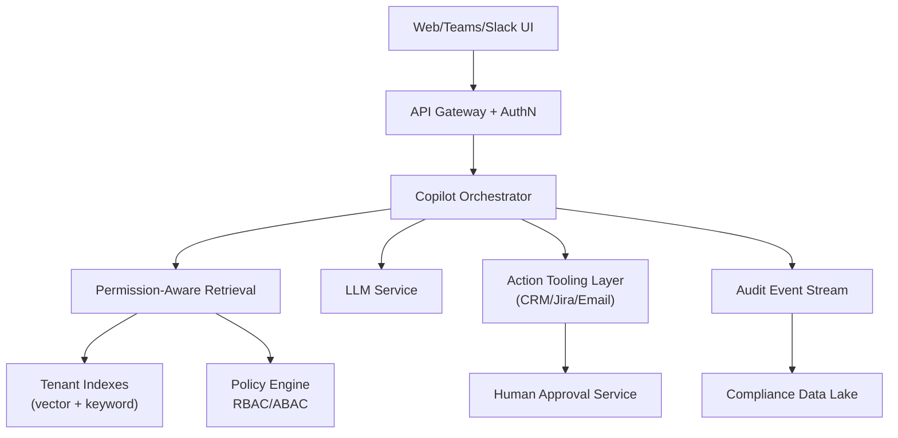

# System Design Walkthrough — Enterprise Copilot (Notion AI / Microsoft 365 Copilot Style)

> Language-agnostic walkthrough using the 6-step framework from `00-system-design-framework.md`.

---

## The Question

> "Design an enterprise AI copilot that answers questions and performs actions across company data (docs, email, tickets, CRM) with strict permissions and auditability."

---

## Core Insight

Enterprise copilots are primarily a **trust and governance system** with AI on top:

1. Retrieval must be permission-aware (never leak unauthorized data).
2. Actions need approval controls and audit logs.
3. Reliability and compliance often matter more than model cleverness.

---

## Step 1 — Clarify Requirements

### Functional Requirements

| # | Requirement |
|---|-------------|
| F1 | Ask natural-language questions over enterprise data |
| F2 | Retrieve and summarize docs/emails/tickets with citations |
| F3 | Execute actions (create ticket, send draft email, update CRM) |
| F4 | Role-based and document-level access control |
| F5 | Human approval for risky actions |
| F6 | Full audit trail for every answer/action |

Out of scope: public web search as primary source, model fine-tuning pipeline.

### Non-Functional Requirements

| Attribute | Target |
|-----------|--------|
| Tenants | 100k organizations |
| P95 answer latency | < 5s |
| Availability | 99.95% |
| Data leakage tolerance | zero cross-tenant leakage |
| Audit retention | 1-7 years (policy dependent) |

---

## Step 2 — Back-of-the-Envelope

```
Assume 100k tenants, 2k active users each peak global mix not simultaneous.
Global peak query load ~50,000 qps.

Per-query retrieval:
  20 candidate chunks from tenant-scoped indexes
  => 1,000,000 chunk lookups/s at peak

Audit logs:
  50k qps x 2 KB event payload ~100 MB/s
  ~8.6 TB/day of raw logs before compression
```

### Why These Numbers Drive Design

- 50k qps is feasible, but only with **strong tenant partitioning** and precomputed indexes.
- 8.6 TB/day log volume forces **streaming log pipeline + tiered storage**, not ad-hoc DB inserts.
- Permission checks per chunk imply access control must be in retrieval index metadata, not bolted on later.

---

## Step 3 — High-Level Design



---

## Step 4 — Deep Dives

### 4.1 Permission-Aware Retrieval

- Every indexed chunk carries tenant ID + ACL metadata.
- Query filter enforces tenant and principal permissions before reranking.
- Final context contains only authorized chunks.

Design choice: filter-before-generate.
Reason: post-generation filtering cannot prevent model exposure to sensitive content.

### 4.2 Action Execution with Guardrails

- Tool calls are schema-validated.
- Risk-scored actions:
  - Low risk: auto-execute (e.g., draft internal note).
  - Medium/high risk: require human approval.
- Idempotency keys prevent duplicate side effects.

Example: "Send refund email to customer" requires manager approval + logged reason.

### 4.3 Audit and Compliance

- Emit immutable events for:
  - user prompt,
  - retrieved sources IDs,
  - model response,
  - action request/approval/execution.
- Store in append-only stream then archive to WORM-capable storage.
- Build compliance views (who accessed what, when, why).

### 4.4 Multi-Tenant Isolation

- Logical + cryptographic isolation per tenant.
- Separate encryption keys per tenant via KMS.
- Rate limits and quotas per tenant prevent noisy-neighbor effects.

---

## Step 5 — Failure Modes

| Failure | Mitigation |
|---------|------------|
| Policy engine outage | fail-closed: deny retrieval/actions |
| Tool connector timeout | async retry queue + user-visible status |
| LLM timeout | return retrieval-only summary fallback |
| Audit sink lag | buffer in durable queue; block risky actions if audit unavailable |

---

## Step 6 — Trade-offs

- Strong governance vs latency (policy checks add overhead).
- More automation vs human approval friction.
- Rich logging vs storage/compliance cost.

Real-world apps to relate: Microsoft 365 Copilot, Notion AI, Slack AI, Salesforce Einstein Copilot.
