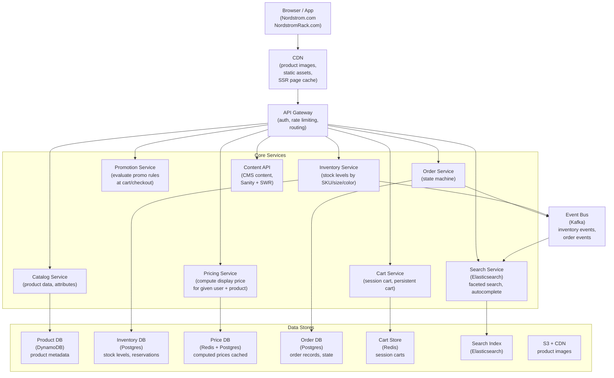
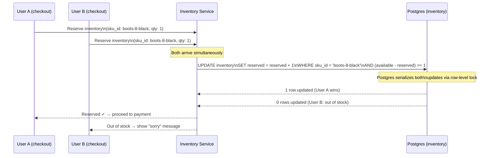
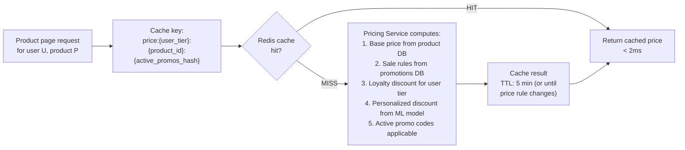
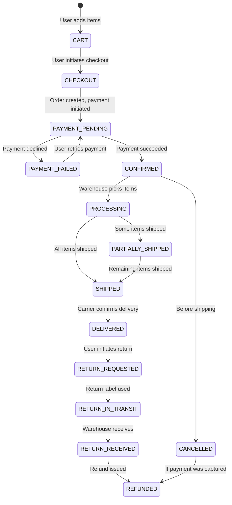
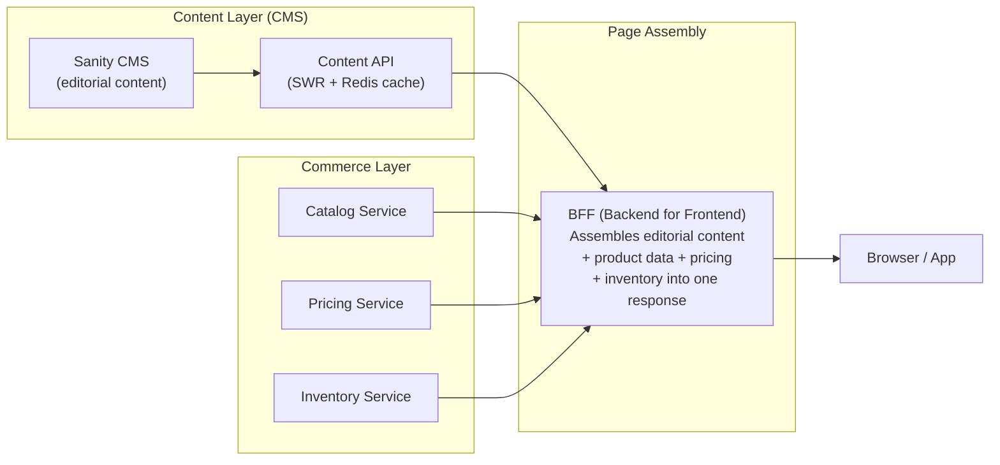

# System Design Walkthrough — E-Commerce Platform (Nordstrom / Retail Scale)

> Relevant for anyone working in retail tech. Covers the core systems that
> power a large department store's digital platform: product catalog, inventory,
> pricing, promotions, order management, and content delivery.
> Uses the 6-step framework throughout.

---

## Why E-Commerce is Different

Most system design resources focus on social media and messaging. E-Commerce
has distinct hard problems:

```
1. Inventory consistency     — two users buying the last item simultaneously
2. Pricing complexity        — base price, sale price, loyalty price, promo price,
                               personalized price — all computed in real time
3. Catalog scale             — millions of SKUs, thousands of attributes per product
4. Promotions logic          — combinatorial rule evaluation at checkout
5. Order state machine       — a purchase goes through 15+ states from cart to return
6. Content + commerce merge  — editorial content (CMS) drives product discovery
```

---

## Step 1 — Requirements

### Functional
- Product catalog: browse, search, filter by attributes (size, color, brand, price)
- Inventory: real-time stock levels, size/color availability
- Pricing: display price (list, sale, loyalty tier, personalized)
- Promotions: discount codes, BOGO, category discounts, loyalty member exclusives
- Cart: add/remove items, persist across sessions and devices
- Checkout: address, payment, order confirmation
- Order management: status tracking, cancellation, returns
- Content: editorial pages, campaign banners, lookbooks driving product discovery

### Non-Functional (Nordstrom scale)

| Attribute | Target |
|-----------|--------|
| Product catalog | 10M+ active SKUs |
| Peak traffic | 500K concurrent users (Anniversary Sale) |
| Product page load | < 2s p99 |
| Search latency | < 200ms p99 |
| Checkout latency | < 3s p99 |
| Inventory accuracy | Near-real-time (< 30s lag acceptable for display) |
| Inventory consistency at purchase | Strong (no overselling) |
| Availability | 99.99% (downtime during peak = direct revenue loss) |

---

## Step 2 — Estimates

```
Catalog:
  10M SKUs × avg 50 attributes × 200 bytes = ~100 GB metadata
  Images: 10M products × 10 images × 500KB = ~50 TB (CDN/S3)
  → Search index: ~200 GB (Elasticsearch)

Traffic (Anniversary Sale peak):
  500K concurrent users
  Each user: 20 product views/session → 10M product views/session
  Session duration: 15 min → 10M / 15min = ~11,000 product page reads/s

  Search: 500K users × 3 searches/session / 15min = ~1,700 searches/s
  Checkout: 500K users × 0.5% conversion/min = ~2,500 checkouts/s (burst)

Inventory:
  Inventory changes: ~50K transactions/s during peak (sales + returns + restocks)
  Each inventory update: ~200 bytes
  → 50K × 200B = 10 MB/s ingress

Orders:
  2,500 orders/s × 2KB per order = 5 MB/s write
  Order records: 2,500/s × 86,400s × 365 = ~79B orders/year (all retailers)
  Nordstrom scale (~0.1%): ~80M orders/year → manageable in Postgres
```

---

## Step 3 — High-Level Design



---

## Step 4 — Detailed Design

### 4.1 Product Catalog — The Data Model Problem

A product at Nordstrom has wildly different attributes depending on category:
- A shoe has: size (numeric), width (narrow/medium/wide), material, heel height
- A handbag has: dimensions, material, closure type, strap drop
- A fragrance has: concentration (EDT/EDP), size (oz), scent family
- Electronics have: wattage, compatibility, warranty

A rigid SQL schema can't represent this. Two approaches:

```
Option A: Entity-Attribute-Value (EAV) in SQL
  product_attributes table: (product_id, attribute_name, attribute_value)
  Flexible but: no type safety, terrible query performance, complex joins

Option B: Document store (DynamoDB / MongoDB)
  Each product is a JSON document with its own schema
  Flexible, fast reads, no join overhead
  Downside: harder to query across products (find all size-8 shoes in black)
  → Solved by syncing to Elasticsearch for cross-product queries
```

**Decision: DynamoDB for product records + Elasticsearch for search**

```
DynamoDB (source of truth):
  PK: product_id
  SK: variant_id (size/color combination)
  Attributes: JSON blob with all product-specific fields
  → O(1) lookup by product_id, fast for product detail page

Elasticsearch (search + discovery):
  Indexed from DynamoDB via Kafka stream (DynamoDB Streams → Kafka → ES indexer)
  Indexed fields: name, brand, category, price_range, attributes (all searchable)
  → Faceted search: "women's shoes, size 8, under $200, black"
  → Autocomplete: "nord..." → "Nordstrom Rack", "Nordic walking shoes"
  → Relevance ranking: combine text match + popularity + personalization signals
```

### 4.2 Inventory — The Consistency Problem

Two users buying the last pair of size-8 black boots simultaneously. Only one
can succeed. This is the hardest correctness problem in e-commerce.



**The two-step inventory model:**

```
Step 1: Reserve at checkout start (soft reservation)
  - Decrement "available to reserve" counter
  - TTL: 15 minutes (released if payment doesn't complete)
  - Prevents showing false availability during checkout

Step 2: Confirm at order completion (hard allocation)
  - Convert reservation to confirmed allocation
  - Triggers inventory replenishment signals to warehouse

Step 3: Release on timeout or cancel
  - Reservation TTL expires → available++ 
  - User cancels → available++
```

**Display availability vs. purchase availability:**

Display (product page, search results) can be eventually consistent — a
5-second lag is acceptable. Uses a Redis cache updated by the Inventory
Service every 5 seconds.

Purchase (checkout reservation) must be strongly consistent — uses Postgres
with row-level locking. Never reads from cache for purchase decisions.

### 4.3 Pricing Service — The Complexity Problem

Nordstrom has multiple price types per product per user:

```
Price hierarchy for a given user + product:
  1. Base price (MSRP): $150
  2. Sale price (if on sale): $120
  3. Loyalty price (Nordy Club member exclusive): $108
  4. Personalized price (loyalty tier × purchase history): $105
  5. Promo code applied: $94.50 (10% off loyalty price)
```

Computing this at page load for 11,000 product page reads/s would be
expensive if done from scratch each time. The solution: price caching with
invalidation.



**Price invalidation:** When a sale starts, the promotions team publishes a
price change event to Kafka. The Pricing Service invalidates all cached prices
for affected products. The next request recomputes from the new rules.

**Why not compute at display time for every user?**
Personalized pricing (loyalty tier) creates N cache entries per product
(one per loyalty tier), not N × users. Most users in the same loyalty tier
get the same price. True per-user personalization is applied as a small
delta on top of the tier price, reducing cache misses to < 5%.

### 4.4 Promotion Engine — The Rules Explosion Problem

Promotions at a retailer are combinatorially complex:

```
Promotion examples:
  - 40% off all shoes in Women's
  - BOGO on selected handbags
  - Extra 15% off for Nordy Club members on sale items
  - $50 off orders over $250 with code SUMMER50
  - Free shipping on orders over $100 for Nordy Club members

Combinations that must be evaluated at checkout:
  - Can SUMMER50 stack with the 40% shoe sale?
  - Does the member extra 15% apply before or after the sale price?
  - Does the $250 threshold use pre-discount or post-discount order total?
```

**The promotion rules engine:**

```
Promotions stored as structured rules in Postgres:
  {
    promotion_id: "summer50",
    type: "order_discount",
    amount: 50,
    amount_type: "fixed",
    minimum_order: 250,
    minimum_order_basis: "pre_discount",
    stackable: true,
    stackable_with: ["loyalty_member_discount"],
    not_stackable_with: ["clearance_sale"],
    eligible_segments: ["all"],
    channels: ["web", "app"],
    starts_at: "2024-06-01",
    ends_at: "2024-08-31"
  }

Rules evaluation at checkout:
  1. Fetch all active promotions applicable to: channel, segment, cart contents
  2. Evaluate each promotion's eligibility (minimum order, segment, channel)
  3. Build dependency graph: which promotions stack, which are mutually exclusive
  4. Apply in defined priority order (site-wide sales → category promos → codes)
  5. Return itemized discount breakdown

Performance:
  Promotion rules loaded into memory on service startup (< 500 active rules at a time)
  Evaluation per cart: < 20ms (in-memory rule evaluation, no DB calls at checkout)
```

**The key insight:** Rules are data, not code. Marketing configures promotions
in the admin UI; the rules engine evaluates them at runtime. Adding a new
promotion type requires adding a new rule schema, not a deployment.

### 4.5 Order State Machine

Every order moves through a defined set of states. Each transition must be
durable and idempotent (payment systems retry).



**State machine implementation:**

```sql
-- Every state transition is a new row, never an update
CREATE TABLE order_events (
  event_id      UUID PRIMARY KEY,
  order_id      UUID NOT NULL,
  from_state    TEXT NOT NULL,
  to_state      TEXT NOT NULL,
  occurred_at   TIMESTAMPTZ DEFAULT now(),
  actor         TEXT NOT NULL,  -- 'user', 'warehouse', 'carrier', 'system'
  metadata      JSONB           -- carrier tracking number, refund amount, etc.
);

-- Current state is the latest event's to_state
-- Full history is queryable
-- Immutable audit trail for disputes
```

### 4.6 Content + Commerce Integration

This is the Nordstrom-specific architecture (the CMS work):



**The BFF (Backend for Frontend) pattern:**

A campaign landing page needs: editorial copy (from Sanity), product tiles
(from Catalog), prices (from Pricing), and stock indicators (from Inventory).
Without a BFF, the client makes 4 separate API calls and assembles the page.
With a BFF, one request returns everything assembled server-side — critical
for mobile performance.

The BFF is thin: it calls the four services in parallel, merges the responses,
and returns a single JSON payload. No business logic lives here.

---

## Step 5 — Decision Log

| Decision | Options | Choice | Rationale |
|----------|---------|--------|-----------|
| Product storage | SQL EAV / Document store | DynamoDB + Elasticsearch | Flexible schema per category; Elasticsearch handles cross-product queries |
| Inventory consistency | Eventually consistent / Strong | Strong for purchase, eventual for display | Overselling is a business and trust problem; display staleness (5s) is invisible to users |
| Pricing cache | No cache / Per-user cache / Per-tier cache | Per-tier cache (Redis) | Most personalization is tier-based; per-user cache explodes to 50M keys |
| Promotions rules | Hardcoded in code / Rules engine | Rules engine (rules as data) | Marketing changes promotions weekly; code deployments for every change are untenable |
| Order storage | Mutable state / Immutable event log | Immutable event log (Postgres) | Full audit trail for disputes; refunds require history; append-only is simpler to reason about |
| Cart storage | DB / Redis | Redis with TTL | Carts are ephemeral; high read/write volume; session affinity not needed |

---

## Step 6 — Bottlenecks

| Bottleneck | Mitigation |
|------------|-----------|
| Anniversary Sale traffic spike (500K concurrent) | CDN for product images and static assets; Redis for pricing cache; read replicas for catalog; Elasticsearch scales horizontally |
| Inventory write contention (same popular SKU) | Row-level lock in Postgres; hot SKUs (limited release shoes) get dedicated lock sharding |
| Promotions evaluation at checkout peak | Rules loaded in memory; no DB calls during evaluation; horizontal scaling of the promotion service |
| Search index lag (new product, price change) | DynamoDB Streams → Kafka → Elasticsearch indexer; near-real-time (< 30s) acceptable |
| Order DB write load at peak | Postgres can handle 2,500 orders/s with connection pooling (PgBouncer); partition by order_date for query performance |
| Content propagation during campaign launch | SWR + Redis cache; content editors publish in Sanity; cache warms within 5 seconds |

---

## Interviewer Hard Questions — E-Commerce Edition

**Q: "A flash sale starts. 10,000 users try to buy the same limited-edition
item with quantity 1 in the first 3 seconds. Walk me through exactly what
happens in your system."**

> 10,000 simultaneous checkout requests hit the Inventory Service. Each calls
> `UPDATE inventory SET reserved = reserved + 1 WHERE sku_id = X AND
> (available - reserved) >= 1`. Postgres serializes these via row-level
> locking. The first request gets `1 row updated`. The other 9,999 get
> `0 rows updated` — they see "out of stock." The winning user proceeds to
> payment. The reservation has a 15-minute TTL. If their payment fails or
> times out, the reservation is released and the item becomes available again.
> The display layer (product page) is eventually consistent — it shows "in
> stock" for up to 30 seconds after it actually sells out, which may cause
> users to add it to cart and then hit "out of stock" at checkout. That's an
> intentional trade-off: polling inventory on every product page view at
> 11,000 reads/s from Postgres (not cache) is too expensive. The display
> staleness is bounded and visible to users as "item sold out during checkout."

**Q: "A promotion is supposed to give 20% off to Nordy Club members. A bug
in the promotion engine accidentally gives 20% off to everyone. You discover
this 2 hours later. What do you do — technically and operationally?"**

> Technically first: disable the promotion rule in the admin UI immediately —
> since rules are data not code, this takes effect within seconds (rules are
> reloaded into memory on a TTL or via invalidation event). No deployment
> needed. New orders stop getting the incorrect discount.
>
> Then scope the impact: query the order events table for orders between the
> deploy time and now that applied the buggy promotion. This gives the exact
> list of affected orders and the over-discounted amounts.
>
> For affected orders: the customer received a discount they weren't entitled
> to. The business decision (not a technical one) is whether to honor it or
> claw it back. Most retailers honor it to protect customer trust — it was
> the company's error. I'd escalate this immediately with the impact report
> (number of orders, total discount amount) so finance and customer service
> can decide.
>
> For future prevention: add a sanity check to the promotion configuration UI —
> "this promotion will apply to all customers, not just loyalty members. Is
> that correct?" Require explicit confirmation for promotions with broader
> than usual eligibility. Add a monitoring alert: "discount rate this hour
> is 3× the rolling average" → page the on-call.

**Q: "Your product search returns results in 180ms. The business wants
personalized search results — showing items more likely to match this
user's purchase history. Adding an ML re-ranking step takes 200ms.
Now your total is 380ms, above the 200ms SLO. How do you fix this?"**

> Three approaches in order of complexity. First, parallelize: the GROQ
> query to Elasticsearch and the ML model call to the personalization service
> can run in parallel if I pre-fetch the user's interest vector when they
> authenticate (store in Redis, TTL 1 hour). Then the search flow is:
> parallel (Elasticsearch query + Redis interest vector lookup) → re-rank.
> The re-ranking model uses the pre-fetched vector, adding ~20ms not 200ms.
>
> Second, two-phase ranking: Elasticsearch returns the top 50 candidates
> (fast, 180ms). The ML model re-ranks those 50 (light model, 30ms). Total:
> 210ms — still close but better. The heavy personalization model runs
> offline and populates the interest vector; the online step is just a
> scoring lookup, not model inference.
>
> Third, pre-compute: for high-traffic search queries (top 1,000 queries
> by volume), pre-compute personalized result sets per loyalty tier offline
> and cache them. At search time, serve from cache for common queries.
> Novel queries fall back to real-time ranking.
>
> The right answer depends on how personalized "personalized" needs to be.
> Tier-level personalization (5 tiers) is much cheaper than per-user
> personalization (50M users).
