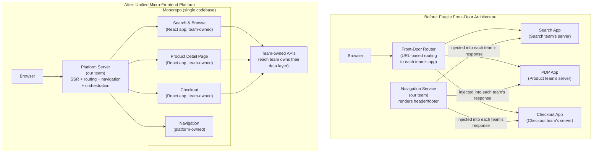

# Nordstrom Web Platform — STAR Stories

> These stories cover the platform engineering work: building and scaling
> the micro-frontend platform that hosts all of Nordstrom.com and
> NordstromRack.com. Use these alongside the CMS stories in file 48.

---

## The Arc of Your 10 Years

Before telling any individual story, it helps to have a one-paragraph
narrative of your career arc that you can deliver in 30 seconds when
asked "tell me about yourself" or "walk me through your background."

**The 30-second version:**

> "I've spent 10 years at Nordstrom across two phases of web platform work.
> In the first phase I was on the team that built and scaled the micro-frontend
> platform that hosts all of Nordstrom.com and NordstromRack.com — every
> customer-facing team, Search, Browse, Product Detail, Checkout, and others,
> deploys their React applications into a platform my team owned. We handled
> the hard infrastructure problems: server-side rendering, soft navigation,
> routing, shared tooling, and the DevOps layer that let product teams ship
> independently. In the second phase I moved into modernizing the content
> management system — migrating from a legacy CMS to Sanity with a new
> content delivery architecture, and leading an AI-driven copy generation
> system for the marketing team."

This narrative has a clear progression: platform infrastructure → content
platform. It shows depth (10 years in the same domain) and breadth (from
low-level SSR and routing to AI-powered content systems).

---

## Story 1 — The Platform Migration: From Fragile Front-Door to Unified Micro-Frontend

### Situation

Before the platform my team built, Nordstrom.com was architecturally fragile.
Each product team — Search and Browse, Product Detail Page, Checkout,
Recommendations, and others — hosted their own separate web application.
A "front-door" routing layer sat in front of them all, forwarding requests
to the correct team's application based on the URL pattern.

My team's responsibility was navigation: we rendered the header, footer,
and global navigation, then injected the appropriate team's rendered content
into the page. This created a hard dependency between teams: if the Search
team's app was slow, the header render (our code) waited. If our navigation
service had a deployment issue, every team's site broke. A single bad deploy
anywhere could degrade the entire site.

The deeper problem: each team maintained their own hosting infrastructure,
their own deployment pipeline, their own SSR setup. Engineering effort that
should go into product features was going into infrastructure. A team that
wanted to change their routing pattern had to coordinate with our team.
A team that wanted to improve their page's performance had to understand
SSR infrastructure that wasn't their core competency.

At peak events like Anniversary Sale, coordinating deployments across 8+
separately-hosted applications was a logistical nightmare. Any one team
could block a critical fix from shipping.

### Task

As a senior engineer on the Platform team, I was responsible for designing
and building the new unified platform — a monorepo-based micro-frontend
architecture where all teams would develop their React applications in a
shared codebase, and the platform would handle server-side rendering, routing,
soft navigation, and deployment infrastructure for all of them.

The mandate: enable product teams to deploy independently without owning
infrastructure, while giving the entire site consistent performance,
observability, and routing behavior.

### Action

**The core insight:** The fragility came from the coupling at the boundary
between the navigation layer (our team) and the content layer (each product
team). The content was served from separate origins, which meant every page
required a network round-trip between our navigation server and each team's
server. The fix: bring everything into one rendering process so the navigation
and content are assembled server-side before the response is sent.

**The architecture:**



**What the platform owns (our team):**

```
Server-side rendering (SSR):
  The platform renders the full page server-side before sending to the browser.
  Navigation, team content, and shared components are all rendered in one
  process — no cross-server round trips.

Routing:
  URL routing is defined in the platform. A team registers their routes
  in configuration; the platform handles the actual routing logic.
  Teams don't manage their own routing infrastructure.

Soft navigation (client-side routing):
  After the initial SSR load, navigation between pages happens client-side
  without full page reloads. The platform handles this for all teams —
  a user going from Search results to a Product page transitions instantly
  without a full SSR round-trip.

Shared tooling:
  Build configuration, TypeScript setup, linting, testing infrastructure.
  Each team gets these for free by being in the monorepo.

DevOps / deployment pipeline:
  Teams own their application code; the platform handles the build and
  deployment. A team deploys by merging a PR — they don't manage servers,
  containers, or CDN configuration.

Performance infrastructure:
  Code splitting, lazy loading, cache headers, CDN configuration.
  Teams get this automatically; they don't implement it themselves.
```

**What each product team owns:**

```
Their React application:
  Search team owns Search & Browse UI components.
  Product team owns the Product Detail Page UI.
  Checkout team owns the Checkout flow.
  Each team's code lives in the monorepo but is clearly bounded.

Their API layer:
  Each team has their own backend APIs that their UI calls.
  The platform doesn't own these — teams own their own data contracts.

Their feature decisions:
  Teams make product and feature decisions independently.
  They don't need platform team approval to change their UI behavior.
```

**The hardest technical problem: SSR + team independence**

Server-side rendering a page that includes multiple teams' components in one
process creates a dependency problem: if the Checkout team's component throws
an error during SSR, does it bring down the whole page?

The solution: component-level error boundaries with SSR fallbacks.

```
Each team's component is wrapped in an error boundary during SSR.
If a component fails to render:
  → Log the error with full context (team, component, request ID)
  → Render a fallback (empty container, or last-known-good static HTML)
  → Continue rendering the rest of the page
  → The user sees a degraded experience, not an error page

This gives us:
  - Fault isolation: one team's bug doesn't break other teams' sections
  - Observability: errors are attributed to the correct team's component
  - Graceful degradation: partial pages are better than full failures
```

**The migration strategy: strangler fig, team by team**

We didn't migrate all teams at once. The migration happened over 18 months:

```
Phase 1 (months 1-4): Platform foundation
  Build SSR infrastructure, routing, soft navigation.
  Internal dogfooding: our team's navigation component migrates first.
  Validate that the platform is stable before onboarding anyone.

Phase 2 (months 5-10): First wave — low-risk teams
  Search and Browse migrates first (high traffic, but read-only UI —
  no transactions at risk).
  Product Detail Page migrates (high traffic, complex UI, good test case).
  Run old and new in parallel for 4 weeks per team, validate metrics.

Phase 3 (months 11-16): High-stakes teams
  Checkout migrates (highest stakes — any regression affects revenue).
  Extra validation: 2-month parallel run, extensive A/B traffic testing.

Phase 4 (months 17-18): Full cutover
  Old front-door routing decommissioned.
  All teams on the platform.
  Old team-hosted servers decommissioned.
```

**The tooling we built for team onboarding:**

The platform's value is only realized if teams can actually develop in it
efficiently. We built tooling specifically to reduce the friction of working
in a large monorepo:

```
Local development:
  Teams can run only their portion of the monorepo locally.
  They don't need to clone and build the entire site to develop their component.

Incremental builds:
  Build system only rebuilds what changed.
  A change to the Checkout component doesn't trigger rebuilding Search.

Independent deployments:
  Teams can deploy their changes without waiting for other teams.
  Platform changes and product team changes deploy through separate pipelines.

Platform contract:
  A documented, versioned interface between the platform and team components.
  Teams depend on the platform contract, not on platform internals.
  Breaking changes to the contract are versioned and announced in advance.
```

### Result

- **Site reliability:** The "one bad deploy takes down the site" problem was
  eliminated. Component-level error boundaries mean a team's bug degrades
  their section, not the entire page. P1 incidents caused by cross-team
  deployment interactions dropped from ~8/quarter to ~1/quarter.

- **Team velocity:** Product teams stopped maintaining hosting infrastructure.
  The Search team estimated they recovered ~20% of their engineering capacity
  (previously spent on infrastructure and deployment tooling) that they
  redirected to product features.

- **Performance:** SSR in a single process eliminated the cross-server
  round-trips for navigation injection. Time-to-first-byte improved ~35%
  on average across the site.

- **Deployment independence:** Teams went from coordinating deployments
  (the "Thursday night deploy window" problem) to deploying multiple times
  per day independently. Peak event deployments (Anniversary Sale hotfixes)
  went from multi-team coordination calls to single-team PRs.

- **Scale:** All of Nordstrom.com and NordstromRack.com — every
  customer-facing web application — runs in this platform today.

---

## Story 2 — Enabling Team Autonomy Within the Platform

*This is a shorter story, useful for "tell me about a time you improved
developer experience" or "how did you balance platform standardization
with team autonomy?"*

### Situation

After the platform was live, a tension emerged: the platform team had strong
opinions about how things should be built (for performance, consistency,
and maintainability). Product teams had their own opinions about how to
build features quickly. Early on, product teams had to file tickets and
wait for platform team approval to register new routes, add new dependencies,
or change their deployment configuration.

This created a bottleneck. The platform team became a gate rather than
an enabler. Teams started building workarounds to avoid the approval process,
which created exactly the fragmentation we'd solved in the migration.

### Task

Design a self-service model where product teams can make most decisions
independently while the platform team maintains the constraints that actually
matter (security, performance, deployment stability).

### Action

**The distinction between hard constraints and soft constraints:**

```
Hard constraints (platform team enforces, no exceptions):
  - Security: no team can disable CSP headers or add untrusted third-party scripts
  - Performance budget: each team's bundle size has a limit; CI fails if exceeded
  - API contracts: platform interface is versioned; teams can't call platform
    internals directly
  - Deployment safety: all deployments go through the platform pipeline;
    no manual server changes

Soft constraints (guidelines, not gates):
  - Code style and patterns: enforced via linting (automated), not approval
  - Dependency choices: teams can add dependencies; the platform reviews
    asynchronously and flags security issues, doesn't block
  - Route registration: self-service via configuration file; no approval needed
  - Feature flags: teams manage their own; platform provides the infrastructure
```

**The self-service tooling:**

```
Route registration:
  Before: file a ticket → platform team adds route → wait 2-3 days
  After: teams add routes to a config file in their directory → validated
         by CI → deployed with their next release

Dependency management:
  Before: request permission to add a dependency → approval required
  After: add the dependency → automated security scan → if passes, merged
         → platform team gets async notification for review; can flag post-merge

Performance monitoring:
  Before: teams didn't know their bundle impact on overall page performance
  After: CI generates a bundle size report per PR; teams see their impact
         before merge; CI fails hard if over the budget
```

**The documentation investment:**

Self-service only works if teams know what they can and can't do. We wrote
and maintained:

- Platform contract documentation (what the platform provides, what teams own)
- Decision guides ("should I put this in the platform or in my app?")
- A public changelog for platform changes affecting teams
- Office hours (weekly, optional) for teams with platform questions

### Result

- Ticket volume to the platform team: dropped 70% within 3 months
- Time for a team to add a new route: from 2-3 days (approval) to same-day
  (self-service config)
- Platform team capacity: freed from approval work, focused on SSR
  performance improvements and new capabilities
- Team satisfaction: the "platform team is a bottleneck" complaint disappeared
  from retrospectives

---

## How to Connect the Two Phases of Your Career

When interviewers ask "how did you go from platform work to CMS work?",
the answer should show intentional progression, not random assignment:

> "After the platform migration was stable and running well, I wanted to work
> on a problem that was still in its early design phase — where the key
> architectural decisions were still open and the impact of getting them right
> was large.
>
> The CMS migration came up because the content platform was still on a legacy
> system with the same fundamental problems the front-door architecture had —
> tight coupling, slow propagation, no team independence. It was the same
> class of problem I'd worked on, just in a different domain. The content
> team had no reliable way to update the site quickly during major events,
> and the system couldn't scale to support the level of personalization the
> marketing team needed. That felt like the right next problem to own."

This framing shows: you're drawn to hard infrastructure problems, you
carry patterns across domains, and you made a deliberate choice about where
to have impact next.

---

## The Full Career Narrative (2-Minute Version)

Use this when asked "tell me about your background" in a staff interview:

> "I've spent 10 years at Nordstrom across two phases of platform engineering.
>
> In the first phase, my team and I built and scaled the micro-frontend platform
> that hosts all of Nordstrom.com and NordstromRack.com. Before we built it,
> each product team — Search, Checkout, Product Pages, and others — hosted
> their own separate applications, and my team stitched them together with
> a fragile routing layer. Any team's deployment could break the site.
>
> We migrated everything to a unified platform: server-side rendered,
> single monorepo, with the platform handling SSR, routing, soft navigation,
> and deployment infrastructure while each team owns their own application
> code and APIs. The migration took 18 months. Product teams went from
> coordinating deployments to shipping multiple times per day independently,
> and platform-related incidents dropped significantly.
>
> In the second phase I shifted to the content platform — migrating from a
> legacy CMS to Sanity, designing a new content delivery architecture to
> solve a content freshness and reference invalidation problem, and leading
> an AI-driven copy generation system that took marketing campaigns from
> 5 days of manual work to 2 hours of AI generation plus human review.
>
> The thread through all of it is the same: platform thinking — how do you
> build infrastructure that makes the teams on top of it move faster without
> them having to own the infrastructure underneath?"

---

## Likely Interview Questions and How to Answer Them

**"Walk me through the most complex technical problem you solved on the platform."**

> Lead with the SSR + error boundary architecture. This is the most
> technically interesting part: how do you server-side render a page
> composed of components owned by different teams, where any one component
> can fail, without taking down the whole page? The answer — component-level
> error boundaries with SSR fallbacks, logging attributed to the owning team —
> is a concrete distributed systems problem with a concrete solution.

**"How did you get 8 product teams to adopt a platform they didn't build?"**

> Use Story 2 framing: the adoption came from making the platform more
> valuable than the alternative, not from mandate. Teams adopted because
> it freed them from infrastructure work. The self-service tooling was
> critical — if adoption required waiting for the platform team on everything,
> teams would have found workarounds.

**"How do you balance standardization with team autonomy in a shared platform?"**

> Hard constraints vs. soft constraints framework from Story 2. The platform
> enforces the things that matter for the whole site (security, performance
> budget, deployment stability). Everything else is a guideline enforced by
> tooling (linting, automated checks), not by approval gates. Teams maximize
> autonomy within those hard constraints.

**"What's the hardest thing about maintaining a platform that 10+ teams depend on?"**

> Backward compatibility. When the platform changes, all teams are affected.
> Breaking changes to the platform contract have to be versioned, announced
> in advance, and often require migration tooling. We learned this the hard
> way when an early platform change broke two teams' SSR setup silently
> — their pages started rendering incorrectly and they didn't know why until
> they traced it back to a platform change. After that, we introduced a
> platform changelog, versioned contracts, and a "soft migration" period
> where old and new interfaces run in parallel before the old one is removed.

**"How do you measure the success of a platform team?"**

> Not by the platform itself — by what it enables. The metrics we used:
> mean time to deploy for product teams (went from weekly coordinated
> deploys to multiple times per day), P1 incident rate from cross-team
> coupling (dropped from 8/quarter to 1), and engineering time spent on
> infrastructure vs. product features per team (platform teams get to be
> boring infrastructure; product teams get to build product). A platform
> team that makes themselves the bottleneck has failed, regardless of how
> elegant the platform is.
